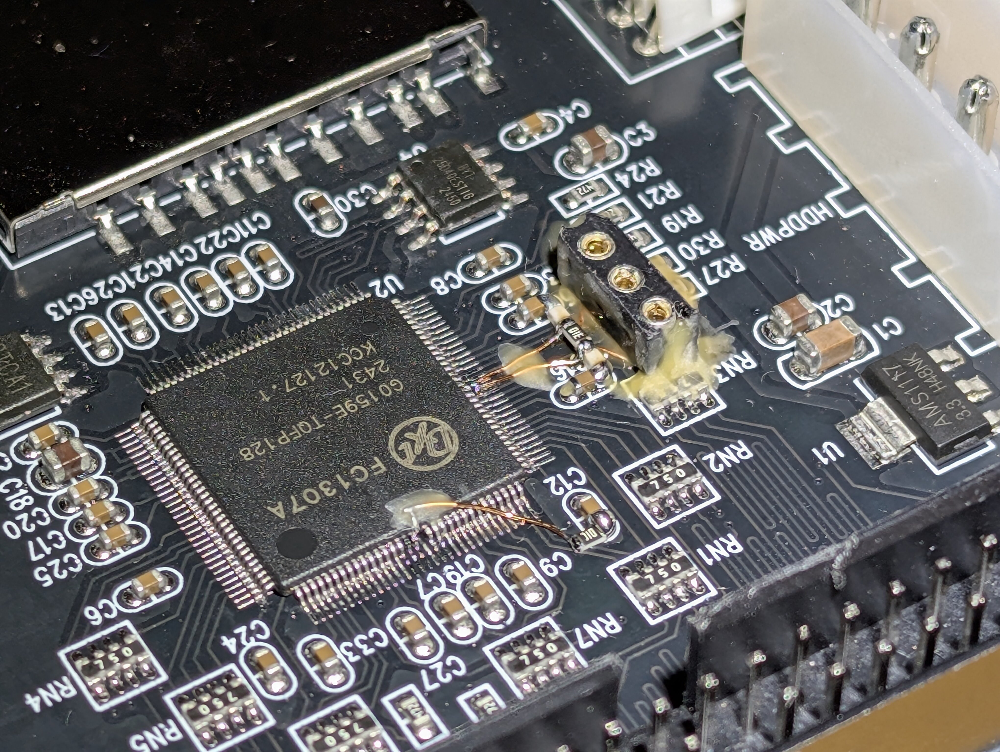
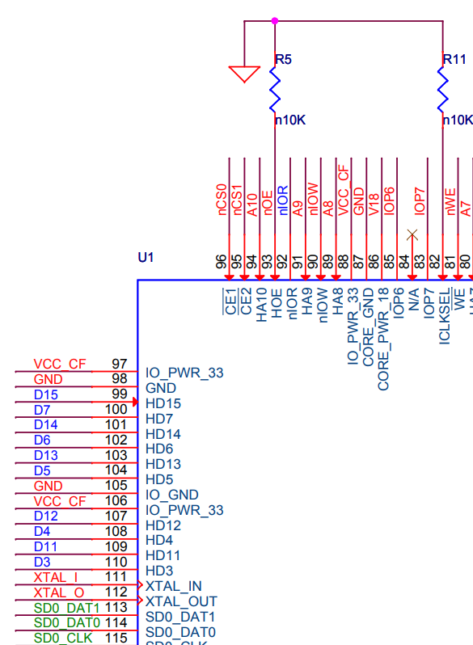
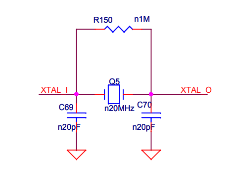

# Overclocking the FC1307A

The FC1307A can be overclocked by connecting an external crystal oscillator:

  

| Frequency        | Read speed, MB/s |
| ---------------- | ---------------- |
| 8 MHz            | 8.05             |
| 16 MHz           | 14.78            |
| 24 MHz           | 20.32            |
| 30 MHz           | 23.86            |
| **32 MHz**       | **25.00**        |
| 48 MHz           | 14.79            |
| Internal (Stock) | 18.75            |

All tests were performed with `HDD Tester 1.1 dual` on a SCPH-70000 PS2 in the UDMA5 64MB read test with 32KB blocks.  
The sweet spot seems to be 32 MHz.

## PSX DESR

The overclocked FC1307A (32 MHz) doesn't seem to be compatible with the PSX.  
All UDMA transfers time out.

## Performing the mod

Most of the available boards use an internal clock source.

To force the FC1307A to use the external clock reference, you need to lift pin 82 of the FC1307A and tie it to ground via a 10 kOhm resistor.  
Then you need to solder an external crystal oscillator to pins 111 and 112.  
Be sure to solder one 20 pF load capacitor from each leg of the crystal to ground:

  

The original schematics also have a 1 MOhm resistor between the external clock pins, so it's a good idea to add one as well:

  

